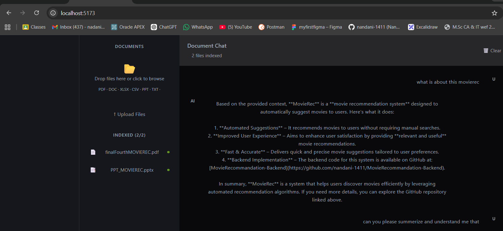

# 🤖 Multi-File RAG Chatbot

AI-powered Retrieval-Augmented Generation (RAG) chatbot that supports multiple document formats including PDF, DOCX, PPTX, Excel, CSV, TXT, HTML, and Images for contextual question-answering using LangChain, FastAPI, React, and vector databases.

---

# 🚀 Features

- Multiple file upload support
- Chat with your documents using AI
- Supports:
  - PDF
  - PPT / PPTX
  - XLS / XLSX
  - CSV
  - TXT

- Semantic search using vector embeddings
- Context-aware responses
- FastAPI backend
- React frontend
- LangChain RAG pipeline
- Vector database integration
- Drag and drop upload UI

---

# 🛠️ Tech Stack

## Frontend
- React
- JavaScript
- Fetch API

## Backend
- FastAPI
- Python
- LangChain
- ChromaDB / FAISS
- Mistral AI

## AI / NLP
- Embeddings
- Retrieval-Augmented Generation (RAG)
- Semantic Search

---

# 📂 Project Structure

```bash
.
├── backend
│   ├── main.py
│   ├── rag.py
│   ├── uploads/
│   ├── requirements.txt
│   └── .env
│
├── frontend
│   ├── src/
│   ├── package.json
│   └── vite.config.js
│
└── README.md
```

---

# ⚙️ Backend Setup

## 1. Clone Repository

```bash
git clone https://github.com/nandani-1411/DocuChat-AI.git
```

---

## 2. Move into Backend

```bash
cd backend
```

---

## 3. Create Virtual Environment

```bash
python -m venv venv
```

---

## 4. Activate Environment

### Windows

```bash
venv\Scripts\activate
```

### Linux / Mac

```bash
source venv/bin/activate
```

---

## 5. Install Dependencies

```bash
pip install -r requirements.txt
```

---

# 🔑 Environment Variables

Create `.env`

```env
MISTRAL_API_KEY=your_api_key
```

---

# ▶️ Run Backend

```bash
uvicorn main:app --reload
```

Backend runs on:

```bash
http://localhost:8000
```

---

# ⚛️ Frontend Setup

## Move into Frontend

```bash
cd frontend
```

---

## Install Dependencies

```bash
npm install
```

---

## Run Frontend

```bash
npm run dev
```

Frontend runs on:

```bash
http://localhost:5173
```

---

# 📡 API Endpoints

## Upload Files

```http
POST /upload
```

Supports multiple file upload.

---

## Chat with Documents

```http
POST /chat
```

Request:

```json
{
  "question": "Summarize the uploaded files"
}
```

---

## Supported Formats

```http
GET /supported-formats
```

---

# 🧠 How It Works

1. Upload documents
2. Extract text from files
3. Split into chunks
4. Generate embeddings
5. Store vectors in database
6. Retrieve relevant chunks
7. Generate AI-powered answers

---

# 💡 Example Questions

- Summarize the uploaded documents
- What are the key topics?
- Extract important points
- Compare information across files
- Generate notes from documents


---

## AI Response



---

# 🔮 Future Improvements

- Streaming responses
- Voice input
- Chat history
- Authentication
- Multi-user support
- Document deletion
- Source citations
- Agentic workflows
- Cloud deployment

---

# 👩‍💻 Author

Nandani Parmar

---

# ⭐ Star the Repository

If you like this project, give it a star ⭐