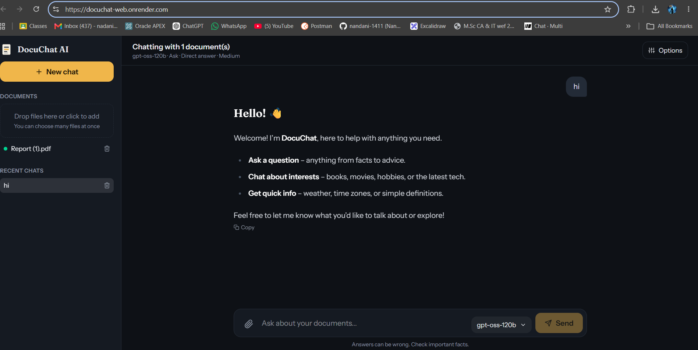
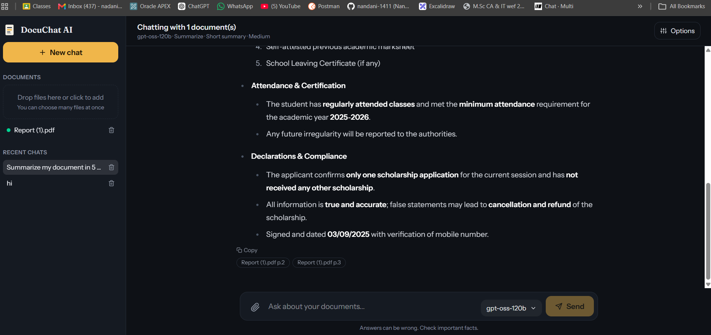

# 🤖 DocuChat-AI

A simple **AI-powered RAG chatbot** that lets you upload multiple documents and ask questions about their content.

### 🌐 Live Demo

👉 https://docuchat-web.onrender.com/

---

## ✨ Features

* 📄 Upload multiple documents
* 💬 Chat with your documents
* 🔍 Semantic search
* 🧠 Context-aware AI responses
* 📁 Supports multiple file formats
* 🖱️ Drag & drop file upload

### 📂 Supported Files

`PDF` · `DOCX` · `PPTX` · `XLSX` · `CSV` · `TXT`

---

## 🛠️ Tech Stack

| Part      | Technology        |
| --------- | ----------------- |
| Frontend  | React, JavaScript |
| Backend   | FastAPI, Python   |
| RAG       | LangChain         |
| LLM       | Groq ,OpenRouter  |
| Vector DB | ChromaDB          |

---

## 🔄 How It Works

```text
📄 Upload Documents
        ↓
🔤 Extract & Split Text
        ↓
🧠 Generate Embeddings
        ↓
🗄️ Store in Vector Database
        ↓
🔍 Retrieve Relevant Content
        ↓
💬 Generate AI Response
```

---

## 🚀 Run Locally

### 1. Clone

```bash
git clone https://github.com/nandani-1411/DocuChat-AI.git
cd DocuChat-AI
```

### 2. Backend

```bash
cd app
python -m venv venv
```

**Windows:**

```bash
venv\Scripts\activate
```

Install dependencies:

```bash
pip install -r requirements.txt
```

Create `.env`:

```env
GROQ_API_KEY=your_groq_api_key
```

Run:

```bash
uvicorn main:app --reload
```

### 3. Frontend

Open a new terminal:

```bash
cd frontend-rag
npm install
npm run dev
```

---

## 📸 Screenshot



With documents:



---

## 👩‍💻 Author

**Nandani Parmar**

[GitHub](https://github.com/nandani-1411)

---

⭐ If you like this project, consider giving it a star!
